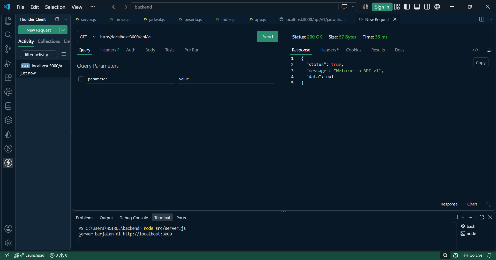
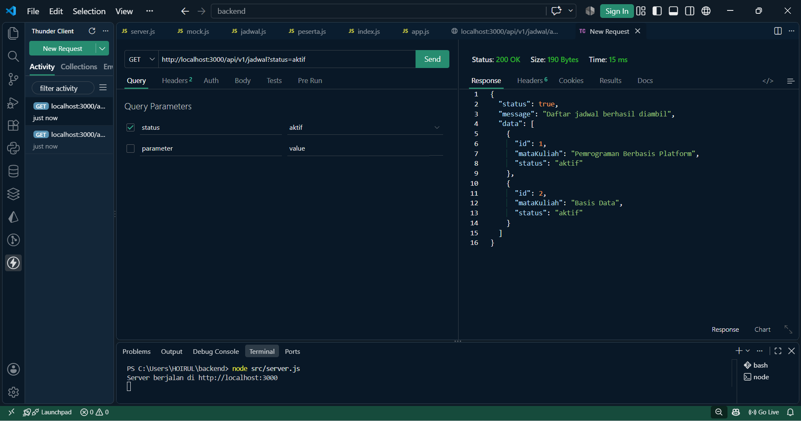
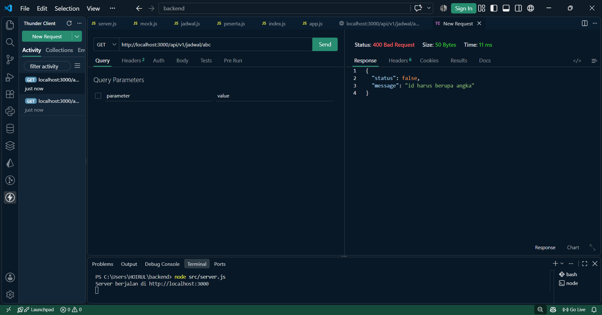
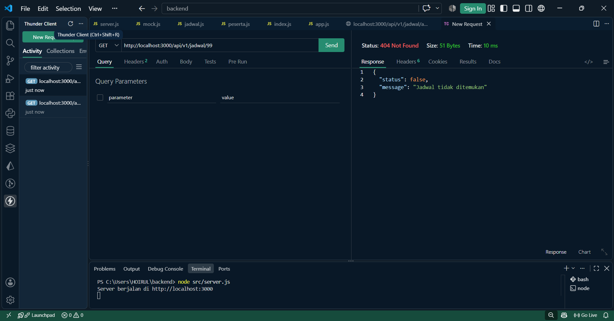
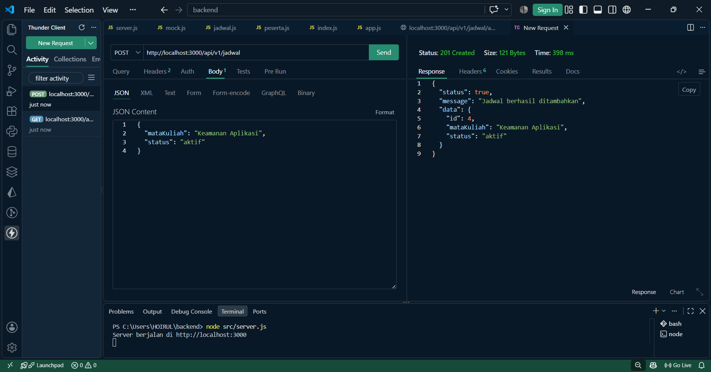
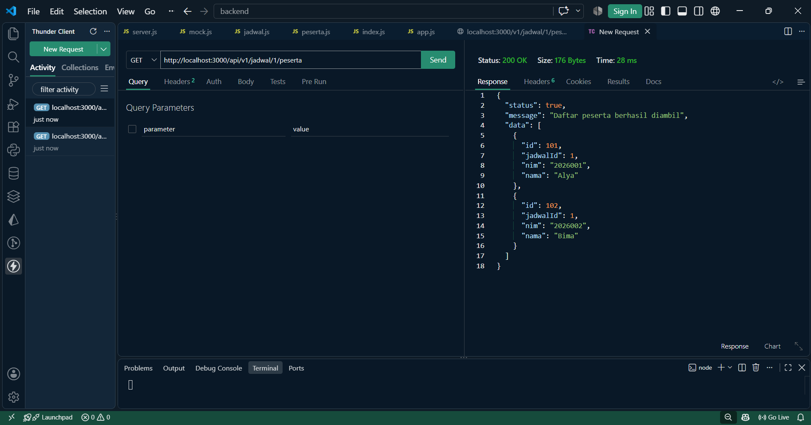
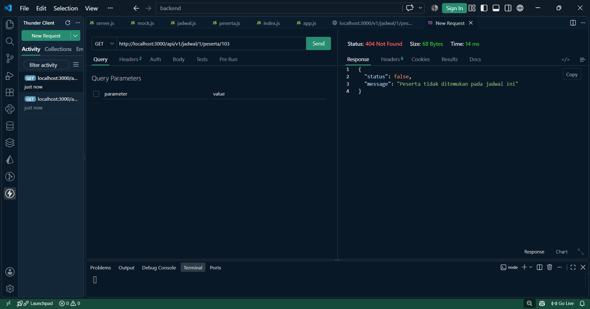
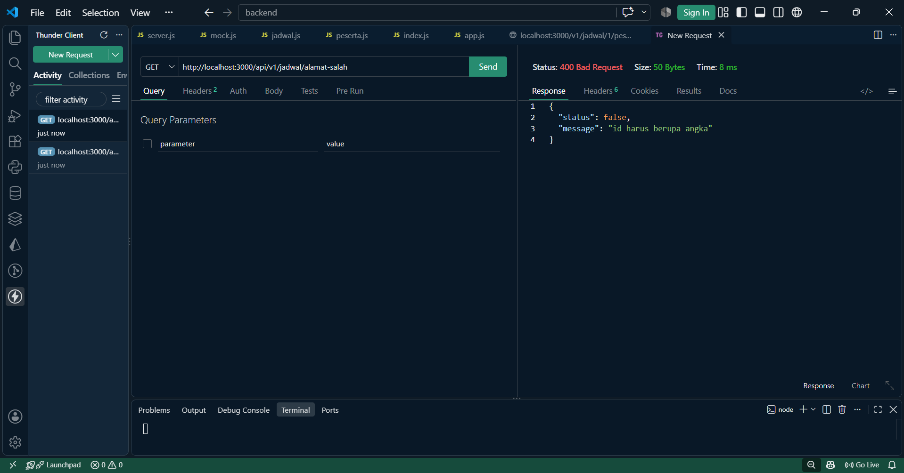

## Tahap 9 - Tabel Pengujian Berdasarkan Respon Terminal

| No. | Request | Harapan | Hasil Aktual |
|---|---|---|---|
| 1. | GET /api/v1 | 200, pesan welcome | 200, pesan welcome berhasil ditampilkan |
| 2. | GET /api/v1/jadwal?status=aktif | 200, hanya data aktif |200, data yang ditampilkan hanya jadwal dengan status aktif |
| 3. | GET /api/v1/jadwal/abc | 400, ide harus angka | 400, muncul pesan bahwa ID harus berupa angka |
| 4. | GET /api/v1/jadwal/99 | 404, jadwal tidak ditemukan | 404, muncul pesan jadwal tidak ditemukan |
| 5. | POST /api/v1/jadwal dengan body valid | 201, objek baru | 201, data jadwal baru berhasil ditambahkan |
| 6. | GET /api/v1/jadwal/1/peserta | 200, peserta jadwal 1 | 200, data peserta dari jadwal 1 berhasil ditampilkan |
| 7. | GET /api/v1/jadwal/1/peserta/103 | 404, peserta berada di jadwal lain | 404, peserta tidak ditemukan pada jadwal 1 |
| 8. | GET /api/v1/alamat-salah | 404, follback route | 404, muncul pesan endpoint tidak ditemukan |

## Bukti Pengujian
### GET /api/v1

### GET /api/v1/jadwal?status=aktif 

### GET /api/v1/jadwal/abc

### GET /api/v1/jadwal/99

### POST /api/v1/jadwal dengan body valid

### GET /api/v1/jadwal/1/peserta

### GET /api/v1/jadwal/1/peserta/103

### GET /api/v1/alamat-salah

