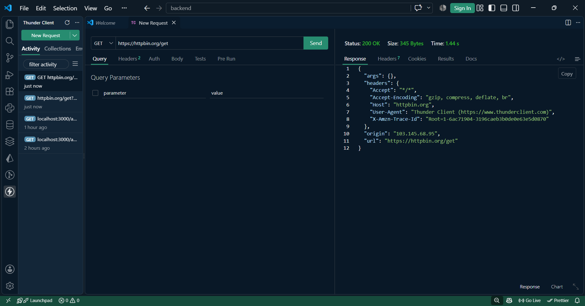
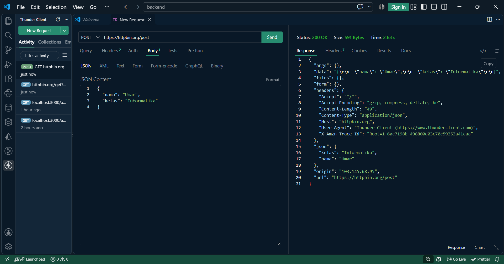
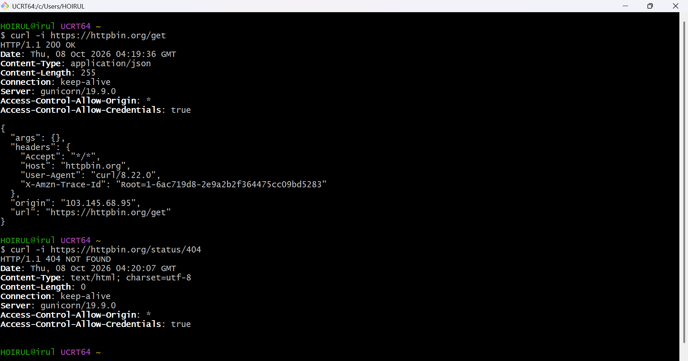
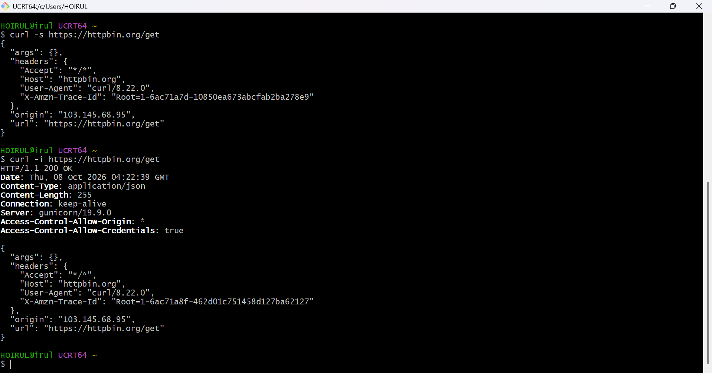

## Tugas Mandiri 4 — Pengujian API dengan Postman dan curl
### Tujuan:
untuk memahami cara melakukan pengujian API menggunakan Postman dan curl, serta membandingkan informasi yang ditampilkan oleh kedua alat tersebut.

## Perbandingan curl -s dan curl -i
Perintah curl -s https://httpbin.org/get menampilkan response body tanpa menampilkan informasi tambahan seperti progress meter, sehingga hasilnya 
lebih sederhana. Opsi -s berarti silent, yaitu menjalankan curl tanpa menampilkan progress atau pesan tambahan. Sementara itu, curl -i 
https://httpbin.org/get menampilkan HTTP response header beserta response body, sehingga kode status seperti 200 OK dan informasi seperti Content-
Type dapat terlihat. Opsi -s cocok digunakan ketika hanya membutuhkan isi response, sedangkan -i berguna ketika ingin memeriksa status HTTP dan 
header dari server.

## Screenshot Pengujian
### 1. POSTMAN GET 

### 2. POSTMAN POST

### 3. CURL-I

### 4. CURL-S

