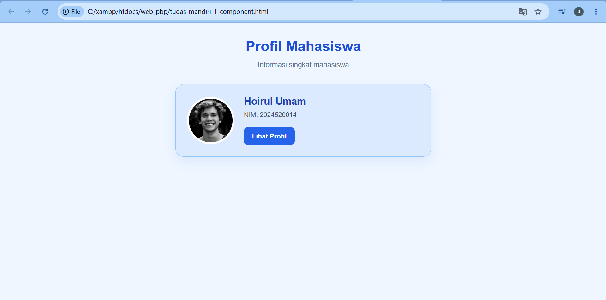
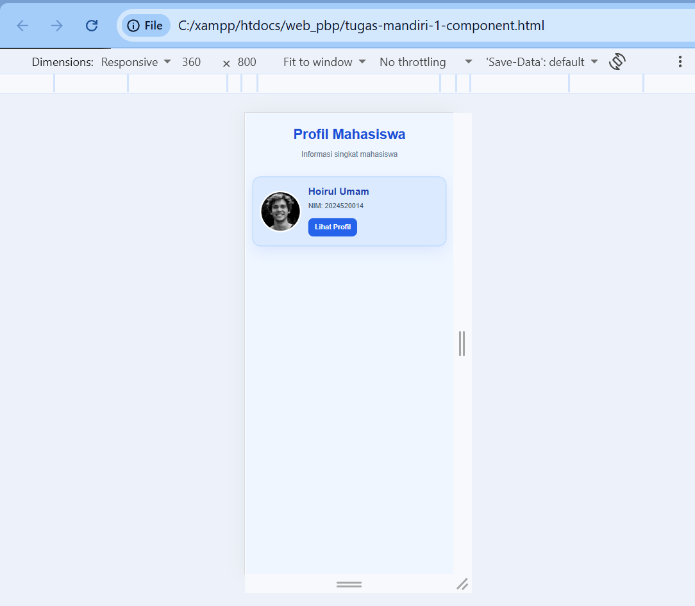
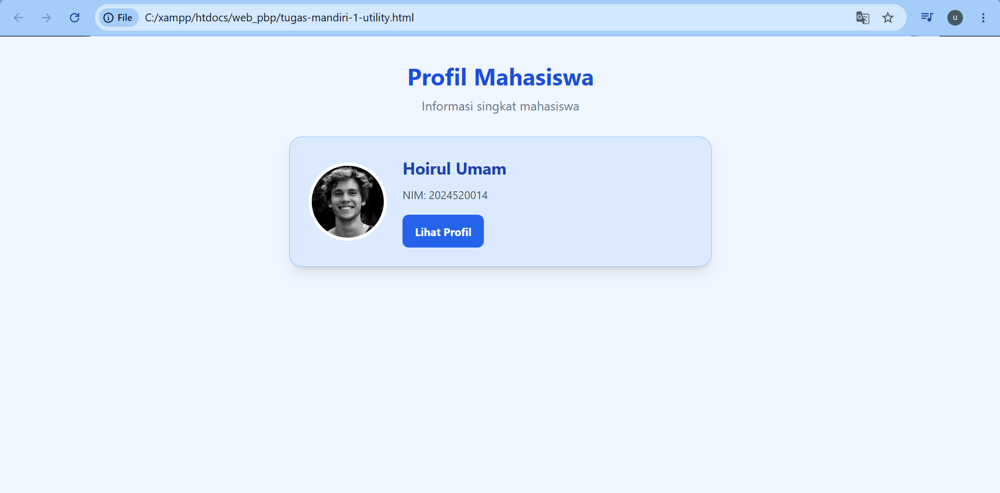
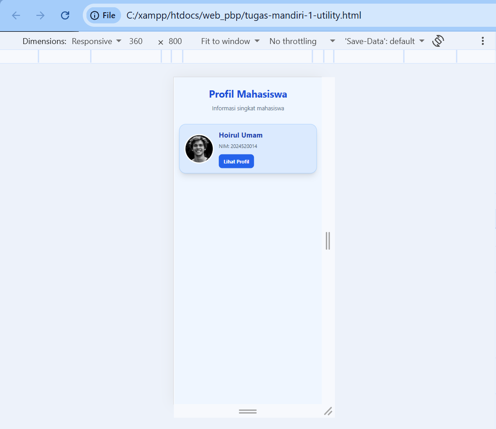

# Laporan Perbandingan Component-Based dan Utility-First CSS

## 1. Tujuan
Membandingkan pendekatan Component-Based CSS dan Utility-First CSS dalam membuat kartu profil mahasiswa yang responsif.

## 2. Hasil Pengerjaan
Kedua pendekatan menghasilkan kartu profil dengan konten yang sama, yaitu foto profil, nama Hoirul Umam, NIM 2024520014, dan tombol Lihat Profil. Kedua tampilan dirancang agar dapat digunakan pada layar laptop maupun layar ponsel dengan lebar 360 px.

## 3. Perbandingan Pendekatan

| Aspek | Component-Based | Utility-First |
|---|---|---|
| Penulisan tampilan | Menggunakan CSS di dalam tag style | Menggunakan class utility Tailwind |
| Pengaturan desain | Melalui class seperti .card dan .btn | Melalui class seperti p-3, rounded-2xl, dan bg-white |
| Jumlah baris CSS | Dihitung dari isi tag style | Tidak ada CSS buatan sendiri |
| Jumlah class utility | Tidak menggunakan class utility Tailwind | Dihitung dari class pada elemen HTML |
| Waktu pengerjaan | Perlu menulis aturan CSS terlebih dahulu | Cenderung lebih cepat untuk desain sederhana |
| Perubahan tema | Mudah jika beberapa elemen memakai class komponen yang sama | Praktis untuk perubahan langsung pada elemen |
| Kerapian kode | HTML relatif lebih ringkas | HTML dapat lebih panjang karena banyak class |
| Penggunaan ulang | Aturan komponen dapat digunakan kembali | Kombinasi class dapat digunakan kembali pada elemen lain |

## 4. Hasil Pengujian Responsif
Pada versi Component-Based, media query digunakan untuk menyesuaikan ukuran foto, teks, padding, dan jarak antarelemen pada layar kecil.
Pada versi Utility-First, class responsif seperti sm:p-6 dan sm:text-[21px] digunakan untuk menyesuaikan tampilan berdasarkan ukuran layar.
Kedua versi perlu diuji pada lebar layar 360 px untuk memastikan tidak muncul gulir horizontal dan seluruh informasi kartu dapat dibaca.

## 5. Perbandingan Waktu dan Kemudahan Perubahan Tema
Dalam percobaan ini, waktu pengerjaan dicatat berdasarkan waktu yang diperlukan untuk membuat dan menguji setiap versi. Pendekatan Utility-First 
diperkirakan lebih cepat untuk membuat tampilan awal karena tidak perlu menulis aturan CSS satu per satu. Pada Component-Based, perubahan warna 
tombol dapat dilakukan melalui aturan .btn sehingga semua tombol yang menggunakan class tersebut ikut berubah. Pada Utility-First, warna dapat 
diubah dengan mengganti class warna pada elemen yang bersangkutan.

## 6. Pilihan Pendekatan untuk Proyek Akhir
Saya memilih Component-Based CSS untuk halaman yang memiliki banyak komponen berulang dengan desain yang konsisten, seperti halaman administrasi, 
dashboard, dan sistem CRUD sekolah. Pendekatan ini memudahkan pengelolaan gaya melalui class komponen. Saya memilih Utility-First CSS untuk 
halaman yang membutuhkan pembuatan tampilan dengan cepat, seperti landing page, halaman promosi, dan prototipe antarmuka. Pendekatan ini 
memudahkan pengaturan jarak, warna, ukuran, dan responsivitas langsung melalui class HTML.

## 7. Kesimpulan
Kedua pendekatan dapat menghasilkan kartu profil yang responsif. Component-Based CSS lebih terstruktur untuk mengelola gaya komponen yang digunakan berulang kali, sedangkan Utility-First CSS lebih praktis untuk menyusun dan menyesuaikan tampilan secara langsung. 

## Bukti
### A. COMPONENT - LAPTOP

### B. COMPONENT - 360PX

### C. UTILITY - LAPTOP

### D. UTILITY - 360PX

